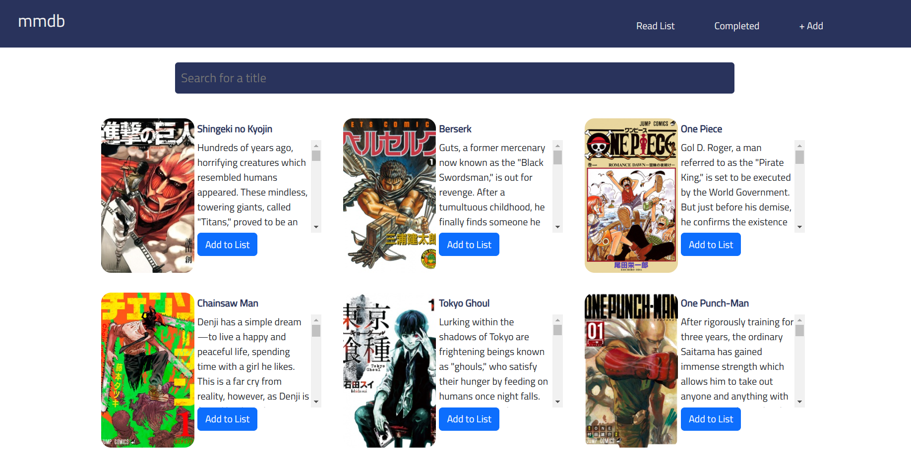
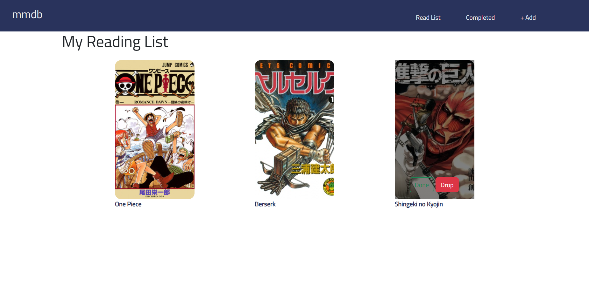
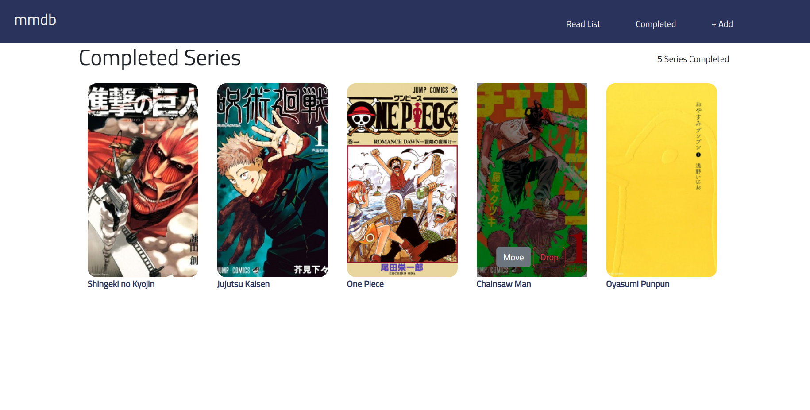

# mmdb

mmdb is a website that allows users to keep tract of their manga reading-lists! 

It uses the Jikan API to look up entries and uses React's localDatabase to store them in your lists.
React's localDatabase allows users the storing of data without the use of an actual database. This
data persists when the browser is closed or when cookies are cleared.

  
  
  

## Recent Changes
mmdb 1.0 - Use of React's localDatabase to store entries